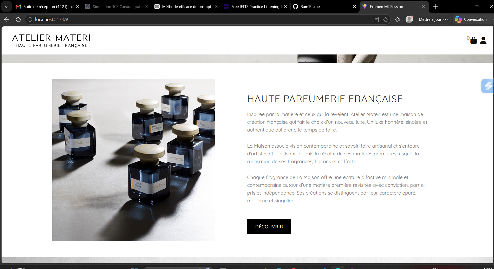

# Perfume Store with Context API

A React perfume storefront focused on reusable components and centralized state management.

The application uses Context API and a reducer to manage product favorites and consumes product data from a lightweight Express backend.

## Preview

## Key Features

- Perfume product catalog
- Product data loaded from an Express API
- Favorites management
- Centralized state with Context API
- Reducer-based state updates
- Reusable React components
- SCSS styling

## Technologies

### Frontend

- React
- Context API
- useReducer
- JavaScript
- SCSS
- Vite

### Backend

- Node.js
- Express
- CORS
- Static product data API
